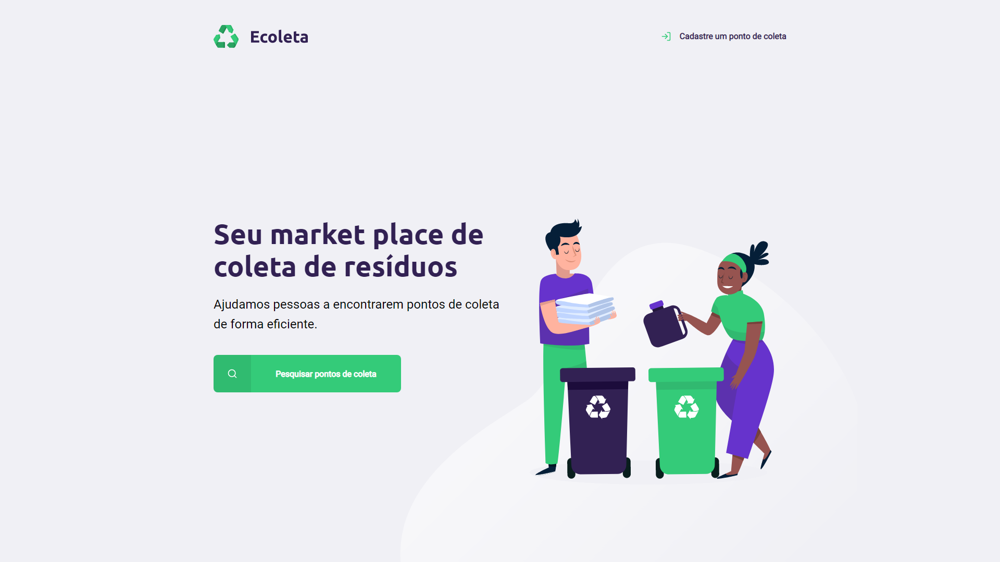
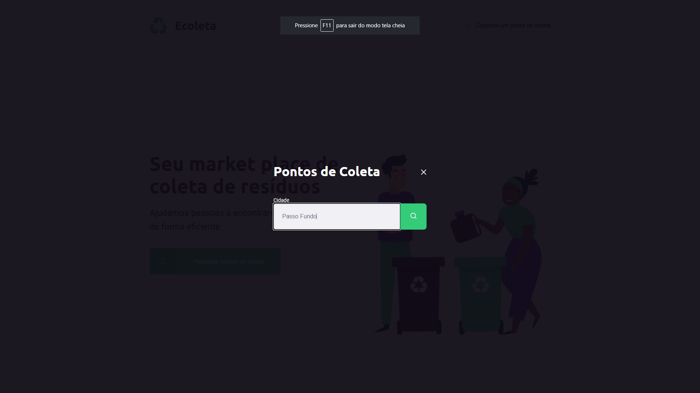

# 

  
+ # Sobre o projeto
  + Um sistema para coleta de resíduos orgânicos e inorgânicos, com cadastro de entidades de coleta e menu de busca para usuários encontrarem o ponto mais próximo. Conectando empresas e pessoas que buscam reciclar, para tornar o mundo sustentável.
  + Este projeto foi desenvolvido durante a next level week, criado pela Rocketseat, uma experiência online com muito conteúdo prático, desafios e hacks que ajudar os dev.

+ ## Algumas telas
  

    
    
  

+ ## Tecnologias utilizadas
  + Front-End
  + JavaScript
  + HTML
  + CSS
  + APIs do IBGE:
    + https://servicodados.ibge.gov.br/api/v1/localidades/estados
    + https://servicodados.ibge.gov.br/api/v1/localidades/estados/{uf}/municipios
    
  + Back-End
    + Node.js
    + Sqlite3
